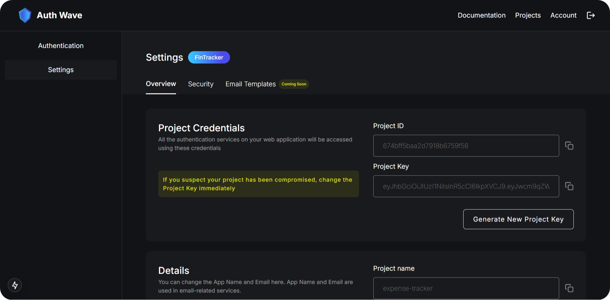

# React Integration

## Installation

Install the AuthWave SDK using npm:

```bash
npm install authwave-sdk
```

## Usage

1. Create a `.env` file in the root directory of your project and paste the project credentials (available at the project settings overview page)

    
    > **NOTE**: For security reasons, it is highly recommended to store your project ID and project key in environment variables. Avoid hardcoding these values directly in your code. Additionally, make sure to change your Project-Key frequently to enhance security.

    ```typescript title=".env"
    AUTHWAVE_PROJECT_ID = "<your-project-id>";
    AUTHWAVE_PROJECT_KEY = "<your-project-key>";
    ```

2. Create a new file named `authService.ts` in your project directory. and initialize the AuthService with your project ID and project key.

   ```typescript title="authService.ts"
   import { AuthService } from "authwave-sdk";

   const authService = new AuthService(
     process.env.AUTHWAVE_PROJECT_ID,
     process.env.AUTHWAVE_PROJECT_KEY
   );

   export default authService;
   ```

3. Use the `authService.createAccount()` method (wrapped in an async function) to create a new user account.

   ```typescript title="SampleComponent.tsx"
   import React, { useState } from "react";
   import authService from "./authService";

   const SampleComponent: React.FC = () => {
     const [username, setUsername] = useState("");
     const [email, setEmail] = useState("");
     const [password, setPassword] = useState("");

    /* ---------------------------------------------------------------- */
    // Method to create a new user-account
     const handleCreateAccount = async () => {
       try {
         const response = await authService.createAccount(
           username,
           email,
           password
         );
         console.log("Account created successfully:", response);
       } catch (error) {
         console.error("Error creating account:", error);
       }
     };
    /* ---------------------------------------------------------------- */

     return (
       <div>
         <h2>Create Account</h2>
         <input
           type="text"
           placeholder="Username"
           value={username}
           onChange={(e) => setUsername(e.target.value)}
         />
         <input
           type="email"
           placeholder="Email"
           value={email}
           onChange={(e) => setEmail(e.target.value)}
         />
         <input
           type="password"
           placeholder="Password"
           value={password}
           onChange={(e) => setPassword(e.target.value)}
         />
         <button onClick={handleCreateAccount}>Create Account</button>
       </div>
     );
   };

   export default SampleComponent;
   ```

    > Although **async/await** is used (and recommended) in the above example, you can also use promises or callbacks to handle the response.

For more information about other SDK methods offered in the AuthService class, head over to [SDK-Integration](SDK-Integration)
