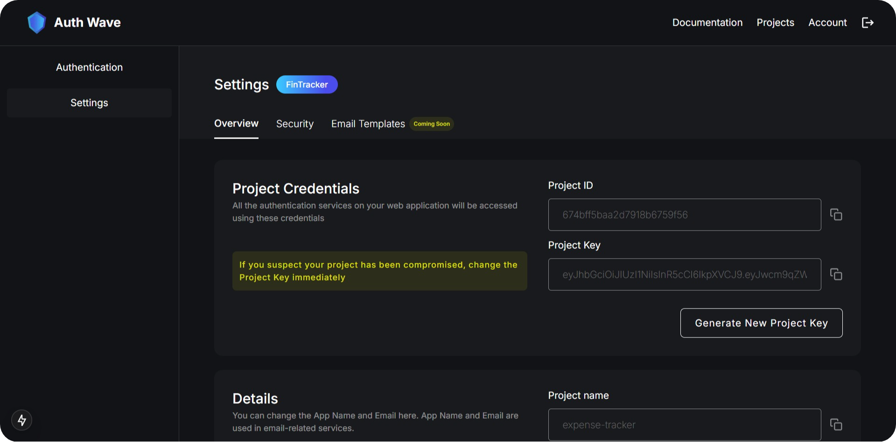

# Create a new project

1. Head over to the [Developer Console](https://authwave.in/console) and sign in with your Auth Wave account.

2. Click on the **Create a new project** button.

    

3. Enter all the required project details and click on the **Create new project** button.

    

4. Once the project is created, move to the **Project Settings** page and save the project ID and project key as they will be required for the SDK integration.

    
